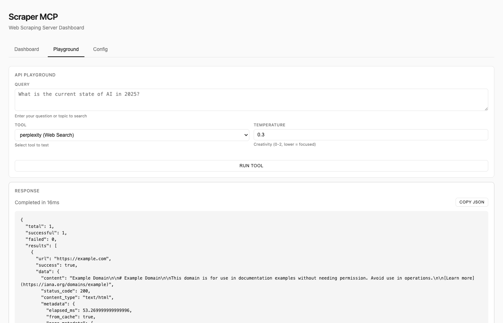

# Dashboard Guide

The Scraper MCP dashboard provides real-time monitoring, testing, and configuration capabilities through a web interface accessible at `http://localhost:8000/`.

## Dashboard Tab

The main dashboard displays four stat cards with live metrics:

### Server Status
- **Status**: Health indicator (green = healthy)
- **Uptime**: How long the server has been running
- **Started**: Server start timestamp

### Request Stats
- **Total Requests**: Count of all requests processed
- **Success Rate**: Percentage of successful requests
- **Failed**: Number of failed requests

### Retry Stats
- **Total Retries**: Sum of all retry attempts
- **Avg Per Request**: Average retries per request (lower is better)

### Cache Status
- **Entries**: Number of cached responses
- **Size**: Total cache size on disk
- **Hit Rate**: Percentage of requests served from cache
- **Clear Cache**: Button to purge all cached data

### Recent Requests Table

Displays the last 100 requests with:
- **Time**: Request timestamp
- **Status**: HTTP status code (green = success, red = error)
- **Response**: Response time in milliseconds
- **URL**: Target URL (truncated if long)
- **AI Badge**: Blue "AI" badge for Perplexity requests

Click any row to open the **Request Details Modal**.

### Recent Errors Table

Shows the last 10 failed requests with:
- **Time**: Error timestamp
- **Status**: HTTP error code or "ERR"
- **Attempts**: Number of retry attempts made
- **URL**: Target URL with error message

## Request Details Modal

Click any request row to view full details:

### Formatted View
- **Type**: Badge showing "Perplexity AI" or "Web Scraper"
- **Status**: Success/Failed badge with HTTP status code
- **Timestamp**: Full date and time
- **Duration**: Request execution time

For **Perplexity AI requests**:
- **Model**: AI model used (e.g., sonar, sonar-pro)
- **Prompt**: Full query sent to Perplexity
- **Response**: AI-generated content (truncated at 3000 chars)
- **Citations**: Numbered list of source URLs
- **Token Usage**: Prompt, completion, and total tokens

For **Web Scraper requests**:
- **URL**: Full target URL
- **Retry Info**: Number of attempts if retries occurred
- **Cached Content**: Scraped content if still in cache

### Raw JSON View
Switch to the "Raw JSON" tab to see the complete unformatted response for debugging or copying.

### Actions
- **Copy JSON**: Copy full response to clipboard
- **Close**: Close the modal (or press Escape)

## Playground Tab

Test scraping and AI tools interactively without writing code.

### Web Scraping Tools

Select one of four scraping tools:
- **scrape_url (Markdown)**: Convert HTML to clean markdown
- **scrape_url_html (Raw HTML)**: Get raw HTML content
- **scrape_url_text (Plain Text)**: Extract text only
- **scrape_extract_links (Links)**: Extract all links

Configure:
- **URL**: Target URL to scrape
- **Timeout**: Request timeout in seconds (default: 30)
- **Max Retries**: Retry attempts on failure (default: 3)
- **CSS Selector**: Optional filter (e.g., `.article-content`)

### Perplexity AI Tools

Select AI-powered tools:
- **perplexity (Web Search)**: AI web search with citations
- **perplexity_reason (Reasoning)**: Complex reasoning tasks

Configure:
- **Query**: Your question or search query
- **Temperature**: Creativity level 0-2 (default: 0.3, lower = focused)

### Response Panel

After clicking "Run Tool":
- **Completion Time**: How long the request took
- **Copy JSON**: Copy response to clipboard
- **JSON Response**: Formatted response with syntax highlighting

## Config Tab

Adjust runtime settings without restarting the server.

### Runtime Configuration

| Setting | Default | Description |
|---------|---------|-------------|
| Concurrency | 8 | Max parallel requests (1-50) |
| Default Timeout | 30 | Request timeout in seconds |
| Max Retries | 3 | Retry attempts on failure |
| Cache TTL - Default | 3600 | Default cache duration (1 hour) |
| Cache TTL - Realtime | 300 | API/live data cache (5 minutes) |
| Cache TTL - Static | 86400 | Static content cache (24 hours) |

### Proxy Settings

Enable proxy routing for corporate firewalls:
- **Enable Proxy**: Toggle to enable/disable
- **HTTP Proxy**: URL for HTTP requests
- **HTTPS Proxy**: URL for HTTPS requests
- **No Proxy**: Hosts to bypass (comma-separated)

### Security Settings

- **Verify SSL Certificates**: Enable for production use (disabled by default for development)

### Important Notes

- Changes apply immediately without restart
- Settings reset when the server restarts
- Use `.env` file for permanent configuration

## Auto-Refresh

The dashboard auto-refreshes every 10 seconds. A countdown timer at the bottom shows time until next refresh.

## Responsive Design

The dashboard adapts to different screen sizes:
- **Wide screens (>1200px)**: 4-column stat card layout
- **Medium screens (600-1200px)**: 2-column layout
- **Mobile (<600px)**: Single column layout
